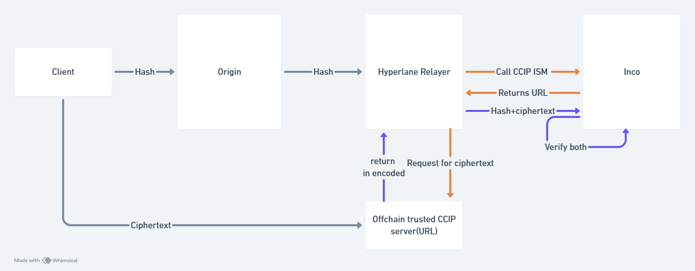

# Integration Guide

## Introduction&#x20;

The motivation for such a setup is to allow applications built on top of other EVM chains to leverage INCO's confidential computing capabilities. Thereby allowing processing of Encrypted data in a confidential manner.

In a conventional approach to enable this, when making crosschain transactions, it is expected that the metadata for the transaction is available on the origin chain as well. However, doing the same for encrypted Ciphertexts can be very expensive as they are large in size. &#x20;

To overcome the same, we can use CCIP-read standard to safely retrieve the necessary ciphertext during relay from any chain to Inco. This is done by only committing the hash of the encrypted data to be processed on the main chain which while being relayed will retrieve the corresponding ciphertext and write to Inco, Where various operations can be performed on the ciphertext.

<figure><figcaption><p>Basic Flow </p></figcaption></figure>

<figure><figcaption><p>User interaction</p></figcaption></figure>

## Integration

### Steps for integration&#x20;

* Develop Sender and Recipient smart contracts adhering to the structure show below&#x20;
* set mailbox and CCIP read ISM to the ISM address in references in INCO recipient during deployment
* Now deploy sender contract to any chain of choice and configure the mailbox to the mailbox of that chain and the recipient to the contract you just deployed on INCO&#x20;
* Now send the necessary Ciphertext to the read server using the URL and request format below&#x20;
* Next send the same calldata to the function which commits Ciphertext hash to inco.
* Now the relayer will query the ciphertext corresponding to the hash during relay time and finally process both ciphertext and hash by calling the `handlewithCiphertext` function on the recipient.

### Uploading ciphertext to CCIP-read server&#x20;

The ciphertext needed to be processed on Inco is uploaded to a server offchain using the following request format.



```bash
curl -X POST https://hyperlane-ccip.vercel.app/token \
     -H "Content-Type: application/json" \
     -d '{"ciphertext": "0x000"}'
```



```javascript
const axios = require('axios');

// Function to send POST request with ciphertext
const postCiphertext = async (ciphertext) => {
    try {
        const response = await axios.post('https://hyperlane-ccip.vercel.app/token', {
            ciphertext: ciphertext
        });
        return response.data;
        //returns hash that can be used to commit to Contract
    } catch (error) {
        console.error('Error posting ciphertext:', error);
        throw error;
    }
};

// Function to send GET request with hash
const getCiphertextByHash = async (hash) => {
    try {
        const response = await axios.get('https://hyperlane-ccip.vercel.app/token', {
            params: {
                hash: hash
            }
        });
        return response.data;
    } catch (error) {
        console.error('Error getting ciphertext by hash:', error);
        throw error;
    }
};

// Example usage
const main = async () => {
    //call API and commit hash to contract
};

// Run the main function
main();

```



&#x20;The post request returns the Hash of the Ciphertext which has to be dispatched from your contract on any EVM chain to the contract on INCO.

returns hash as response

```
Response :
{
    hash : "0x6c3bf3dccc39df78b946f2d49077e90fc88a90c7c3f06ab17244a9850d3dc85b"
}
```

now the hash and corresponding Ciphertext is available in the CCIP read server and can be retrieved by relayer.

### Smart Contract Integration

We will have to configure our smart contract logic on both origin chain and Inco to make sure this setup works. The guide and template code for integration is shown below

### Origin Chain Contract

The integration to smart contracts on origin chain will be same as dispatch function used in Hyperlane. The origin chain can hold the hash of the ciphertext. while the metadata is made available on Inco for the corresponding hash.

We can also retrieve the hash of the ciphertext from the function for verification purpose.\
You can refer the following template code.&#x20;


```solidity

// SPDX-License-Identifier: UNLICENSED
pragma solidity ^0.8.19;

import {IMailbox} from "@hyperlane-xyz/core/contracts/interfaces/IMailbox.sol";
import {IPostDispatchHook} from "@hyperlane-xyz/core/contracts/interfaces/hooks/IPostDispatchHook.sol";
import {IInterchainSecurityModule} from "@hyperlane-xyz/core/contracts/interfaces/IInterchainSecurityModule.sol";
import {Address} from "@openzeppelin/contracts/utils/Address.sol";
import {OwnableUpgradeable} from "@openzeppelin/contracts-upgradeable/access/OwnableUpgradeable.sol";


contract CipherTextCommitment is OwnableUpgradeable{
     IPostDispatchHook public hook;
      address mailbox;
      address recipient;
      mapping (bytes32 =>bytes32) hash;
      uint32 DomainID=9090;
      function setHook(address _hook) public onlyOwner {
        hook = IPostDispatchHook(_hook);
    }
    event hashedCiphertext(bytes32 _hash);
 constructor(address _mailbox,address _recipient) {
        mailbox = _mailbox;
        recipient=_recipient;
    }
    modifier onlyMailbox() {
        require(
            msg.sender == mailbox,
            "Only mailbox can call this function !!!"
        );
        _;
    }
//template code 
  function CommitCiphertextHash(bytes calldata Ciphertext) payable external returns (bytes32) {
    //necessary snippet
    bytes32 _hash = keccak256(Ciphertext);
    hash[_hash] = _hash;

    //necessary snippets
    uint256 quote = IMailbox(mailbox).quoteDispatch(DomainID, addressToBytes32(recipient), abi.encode(_hash));
    IMailbox(mailbox).dispatch{value: quote}(DomainID, addressToBytes32(recipient), abi.encode(_hash));
    emit hasher(_hash);
    return _hash;
}

    
      function addressToBytes32(address _addr) internal pure returns (bytes32) {
        return bytes32(uint256(uint160(_addr)));
    }
}
```


Or you can interface an existing dispatch contract to your contract

```solidity
// SPDX-License-Identifier: UNLICENSED
pragma solidity ^0.8.19;
interface ICipherTextCommitment {
function CommitCiphertextHash(bytes calldata Ciphertext) external payable returns (bytes32);
}

```


Additional metadata can be sent alongside hash, but hash must be the first variable while encoding according to ABI followed by arbitrary data of your choice.


### Inco gentry smart contract&#x20;

The smart contract on Inco has slight modifications needed to process our message&#x20;

1. We will have to define the ISM to be CCIP-read ISM by specifying the address of ISM in the reference section by calling the  `setInterchainSecurityModule` in the contract.
2. Additional handler function called `handleWithCiphertext` is called by ISM to pass the Ciphertext&#x20;

Use the following template code&#x20;


```solidity
// SPDX-License-Identifier: UNLICENSED
pragma solidity ^0.8.19;

import {IMailbox} from "@hyperlane-xyz/core/contracts/interfaces/IMailbox.sol";
import {IPostDispatchHook} from "@hyperlane-xyz/core/contracts/interfaces/hooks/IPostDispatchHook.sol";
import {IInterchainSecurityModule} from "@hyperlane-xyz/core/contracts/interfaces/IInterchainSecurityModule.sol";
import {Address} from "@openzeppelin/contracts/utils/Address.sol";
import {OwnableUpgradeable} from "@openzeppelin/contracts-upgradeable/access/OwnableUpgradeable.sol";

contract CipherTextProcessor is OwnableUpgradeable{
    IInterchainSecurityModule public interchainSecurityModule;
        function setInterchainSecurityModule(address _module) public {
        interchainSecurityModule = IInterchainSecurityModule(_module);
    }
    event handled (bytes32 hash);
    address mailbox; // address of mailbox contract
    address public ISM;

    constructor(address _mailbox, address _interchainSecurityModule) {
        mailbox = _mailbox;
        ISM=_interchainSecurityModule;
        //Sets CCIP read ISM as ISM to be used
        setInterchainSecurityModule(_interchainSecurityModule);
        
    }

    // Modifier so that only mailbox can call particular functions
    modifier onlyMailbox() {
        require(
            msg.sender == mailbox,
            "Only mailbox can call this function !!!"
        );
        _;
    }
        modifier onlyISM() {
        require(
            msg.sender == ISM,
            "Only mailbox can call this function !!!"
        );
        _;
    }
 //no-op function but called by mailbox pos verification so keep
  function handle( uint32 _origin,
        bytes32 _sender,
        bytes memory _body)external onlyMailbox {
           (bytes32 committedHash)=  abi.decode(_body, (bytes32));
           emit handled(committedHash);

  }
  //*************************************************************************
  // Necessary function to be implemented with no changes as it is  called by ISM with metadata
  function handleWithCiphertext( uint32 _origin,
        bytes32 _sender,
        bytes memory _message)external onlyISM {
  (bytes memory message,bytes memory ciphertext)=abi.decode(_message,(bytes , bytes));
   (bytes32 committedHash)=  abi.decode(message, (bytes32));
   //rest of function logic 
        }
  //**************************************************************************

}
```


This will allow the ISM to write the ciphertext and hash on your recipient.


As of the time of writing this implementation is not maintained by Inco but [Sudeep Kamat](https://app.gitbook.com/u/YwKmlDIUUhNZyGi2kDHC8hc1qC43 "mention"). So, use at your own discretion.

